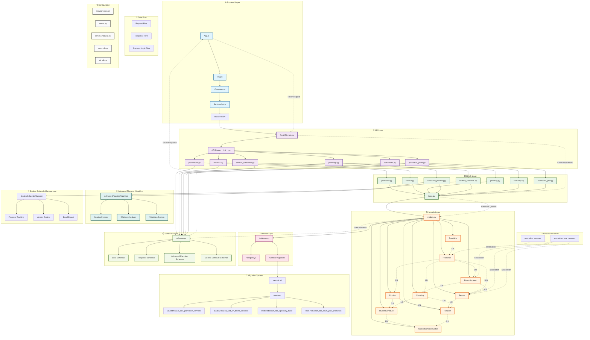
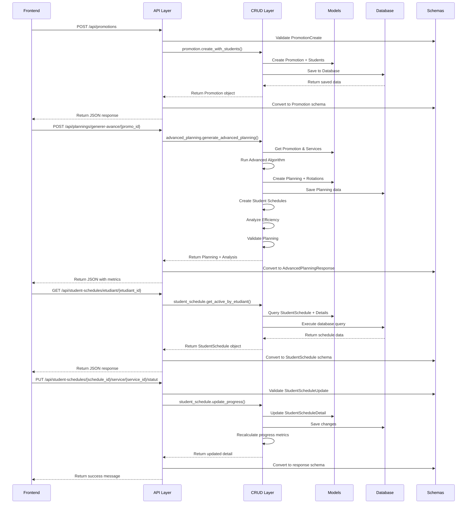
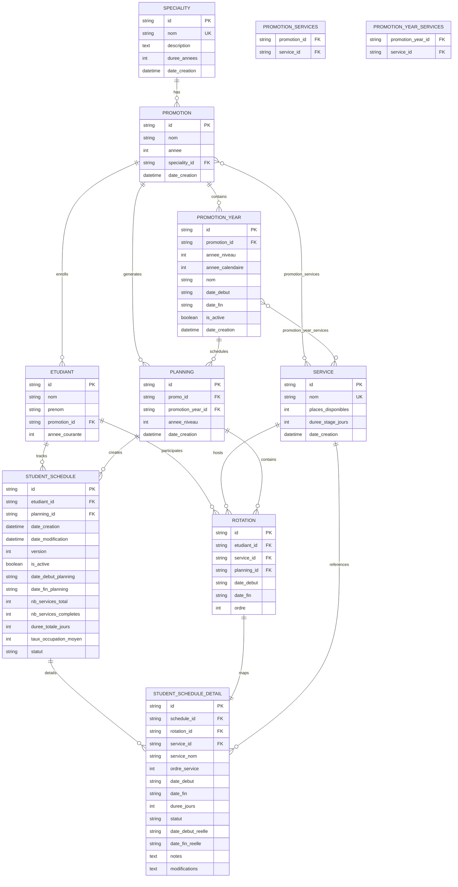
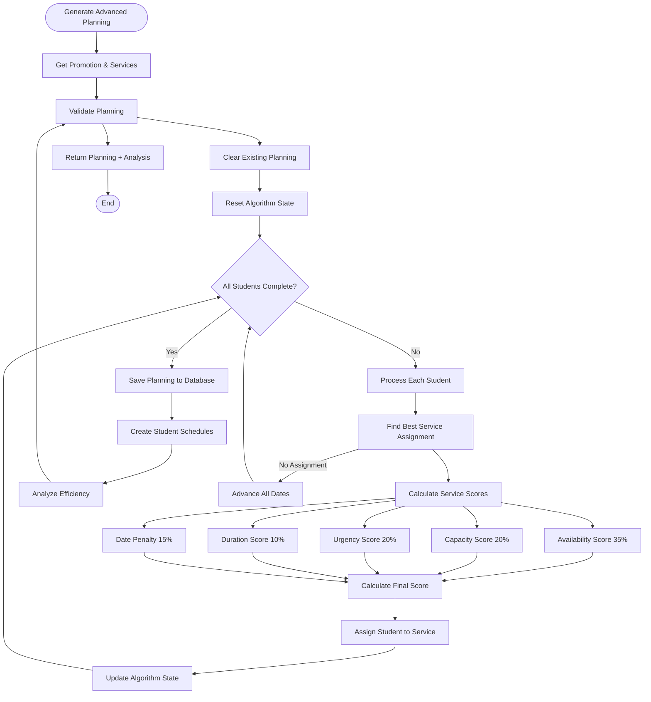
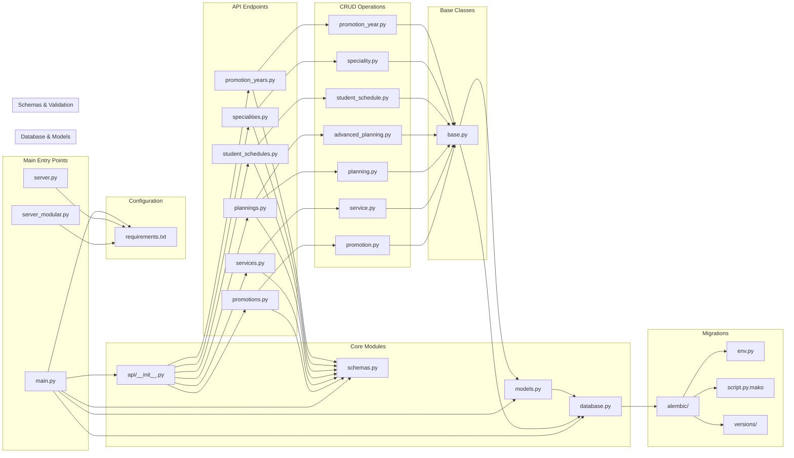

# 🏥 Stages Paramédicaux - System Architecture

## 📊 Complete System Interconnection Diagram

## 🔄 Detailed Data Flow Diagram

## 🏗️ Database Schema Relationships

## 🧠 Advanced Planning Algorithm Flow

## 📊 File Dependencies and Imports

## 🎯 Key System Features

### ✅ **Advanced Planning Algorithm**

- **Intelligent Scoring**: 5-factor weighted scoring system
- **Load Balancing**: Optimal resource utilization
- **Conflict Resolution**: Automatic scheduling conflict handling
- **Efficiency Analysis**: Real-time performance metrics

### ✅ **Student Schedule Management**

- **Progress Tracking**: Real-time status updates
- **Version Control**: Schedule versioning for audit trails
- **Excel Export**: Administrative reporting capabilities
- **Multi-Year Support**: Flexible academic program management

### ✅ **Database Architecture**

- **Normalized Design**: No data redundancy
- **Proper Relationships**: Foreign key constraints
- **Scalable Structure**: UUID primary keys
- **Migration System**: Alembic for schema evolution

### ✅ **API Design**

- **RESTful Endpoints**: Clean HTTP interface
- **Type Safety**: Full Pydantic validation
- **Error Handling**: Comprehensive error responses
- **Documentation**: Auto-generated API docs

### ✅ **Frontend Integration**

- **100% Coverage**: All backend endpoints consumed
- **Real-time Updates**: Live data synchronization
- **User Experience**: Modern React interface
- **Responsive Design**: Mobile-friendly interface

## 🏆 System Rating: 9.5/10

This system demonstrates **enterprise-grade architecture** with sophisticated business logic, comprehensive data modeling, and excellent code organization. The interconnection between all components is well-designed and maintains clean separation of concerns while providing powerful functionality for medical internship management.
